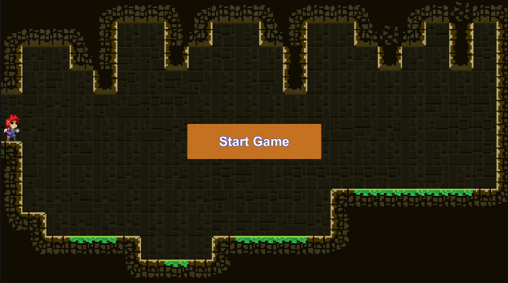
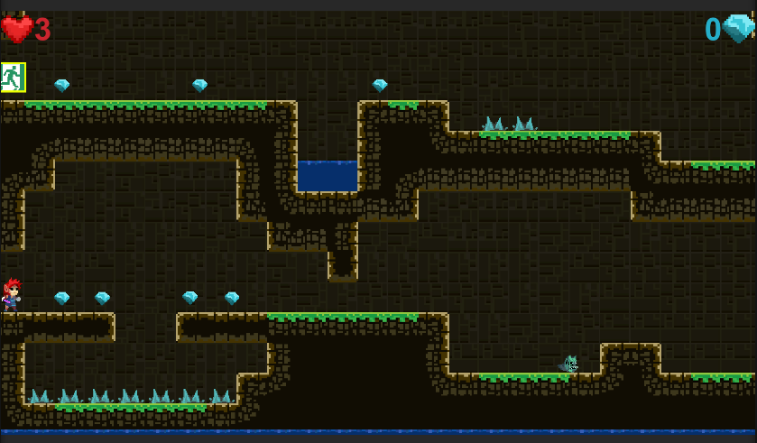
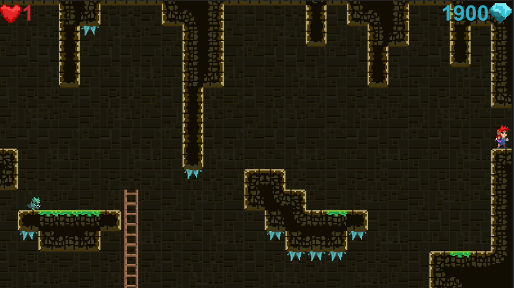
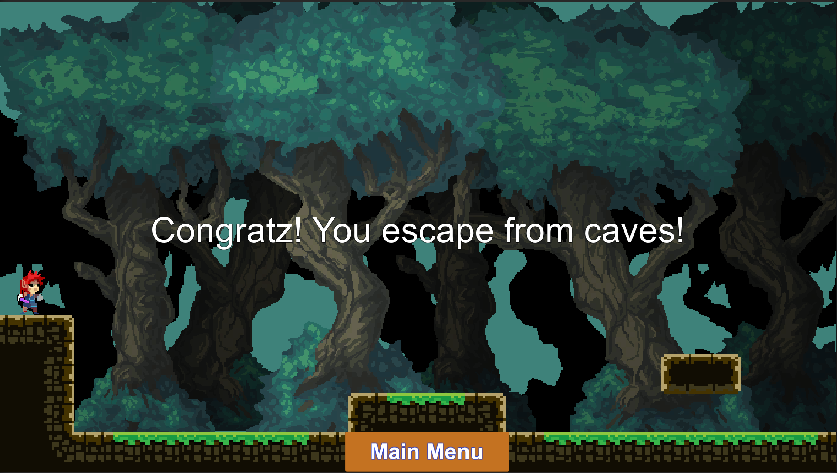

# PlatformJump

<table>
<tr>
<td>Жанр</td><td>2D platformer</td>
</tr>
<tr><td>Сеттинг </td><td>fantasy</td>
</tr>
<tr>
<td>Время на игру</td> <td>5-10 мин</td>
</tr>
<tr>
<td>Где можно сыграть</td> <td>https://sharemygame.com/@kpblcke/platform-jump</td>
</tr>
</table>

Управление: 
AD - Бег вправо и влево 
WS - Спуск, подьем по лестнице 
Space - Прыжок 
 
Описание: 
Вы попали в неизвестную пещеру и её начинает затапливать, быстрее ищите выход!

